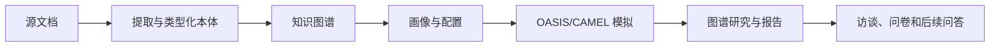

# MiroFish Research Lab

**基于 MiroFish 的研究工作台，正在升级为自托管知识图谱和可追溯证据的模拟平台。**

  

[English](README.md) · [开发说明](docs/development.md) · [路线图](ROADMAP.md)

本项目保留 MiroFish 的 Vue、Flask、OASIS/CAMEL 和调查报告流程作为源码基础。已确定的目标知识系统是 Graphiti + 自托管 Neo4j Community。后续可在明确配置和限额下使用付费模型 API。

> **项目状态：U00 源码导入，尚未验收。** 导入的应用目前仍调用 Zep Cloud。Graphiti/Neo4j 是目标，并非已完成的替代。尚未证明完整的无 Zep 流程、安全加固、发布包或可支持的部署。不要将继承的基线对外开放，也不要导入真实敏感资料。下述 CI 仅涵盖夹具/单元测试和前端构建。

---

## Screenshots / 截图

目前没有来自已验收 Research Lab 版本的截图。计划使用合成数据截取引导流程、双平台监控、图谱与证据、报告与实验界面。[上游归档 README](docs/upstream/README-ZH.md.reference) 中的图片属于上游 MiroFish，不代表本项目的验收状态。

## Why this exists / 项目缘由

MiroFish 已连接资料、知识图谱、智能体群体、两种社交环境及调查报告。本衍生项目旨在保留这些能力，并提高证据、恢复、所有权、成本和部署的可检查性。24 项继承要求与 20 项升级见[能力清单](docs/plan/CAPABILITY-REGISTER.md)。

## What it does / 功能

导入源码包含文档摄取、类型化本体与图谱服务、模拟设置与运行、图谱浏览、报告、访谈、问卷及后续问答。这些只是**从源码观察到的能力**，不是本项目的验收结论。Graphiti 运行集成、证据溯源、持久实验及全本地模式仍待开发。

## How it works / 工作流程



导入版本的图谱路径仍使用 Zep Cloud。Graphiti 和 Neo4j Community 是既定替换方案；此图不表示 Research Lab 端到端流程已经通过测试。

### U00 阶段的执行顺序

目前可执行的是离线源码检查流程，并非应用启动流程：

1. 安装精简单元测试依赖，检查导入源码清单。
2. 运行 `python tools/run_unit_tests.py`；它使用虚拟提供者密钥运行两个继承的 pytest 目录，禁用 `.env` 加载，阻止非本机回环连接，同时允许本地 HTTP 夹具。
3. 单独构建继承的 Vue 前端。目前尚未验收 Research Lab 后端服务或浏览器使用流程。

Graphiti/Neo4j 集成、安全性和实时工作流程通过验收后，才会记录受支持的运行启动顺序。

## Requirements / 环境要求

| 用途 | 当前要求或状态 |
| --- | --- |
| 源码与单元工作 | 初始 CI 选择 Python 3.12 和 Node 24.14.1；后端元数据允许 Python 3.11–3.12。 |
| 前端夹具构建 | 使用 `frontend/package-lock.json` 和 npm；无需模型密钥或数据库。 |
| 完整继承后端 | 仍含 OASIS/CAMEL、模型 API 与 Zep；不是受支持的 Research Lab 部署。 |
| 目标混合模式 | 自托管 Graphiti/Neo4j Community + 已配置模型 API；版本和资源需求待验证。 |
| 全本地模式 | U12 计划验证；目前没有断开云网络的保证。 |

继承的 `npm run dev`、`setup:all` 和 Docker 文件不应当作安全、受支持的启动路径。

## Quick start / 开始使用

### 检查源码

[归档清单](docs/upstream/archive-manifest.json) 记录 ZIP 及全部 128 个导入文件的哈希。使用 Python 3.12 运行 `python tools/check_baseline_manifest.py` 可以比较文件字节；此命令不验证应用行为。

### 离线开发构建

在仓库根目录进入 `frontend/`，执行 `npm ci --ignore-scripts` 和 `npm run build`。继承的夹具/单元测试需先在一次性 Python 3.12 环境中安装 `tools/ci-unit-requirements.txt`，然后运行 `python tools/run_unit_tests.py`。完整命令和范围见[开发说明](docs/development.md)。安装依赖需要访问软件包源；启动器将测试进程的连接限制为本机回环夹具。

### 启动、冒烟测试和打包

U00 没有受支持的 Research Lab 启动方式或发布包。Graphiti/Neo4j 集成、安全启动、实时测试、持久卷、备份恢复和打包各有独立验收门槛。[发布页面](https://github.com/desanv01/mirofish-research-lab/releases) 链接不表示已有合格制品。

## Command-line reference / 命令参考

| 命令 | 作用 |
| --- | --- |
| `python tools/check_baseline_manifest.py` | 检查 128 个导入路径和哈希；不一致时返回非零。 |
| `python tools/run_unit_tests.py` | 安装精简依赖后，以虚拟密钥和仅限本机回环的套接字防护运行继承的夹具/单元测试。 |
| 在 `frontend/` 执行 `npm run build` | 构建继承的 Vue 前端。 |

这些是开发检查命令，而非服务启动或导出命令；目前没有 Research Lab 专用诊断、导出或迁移 CLI。

## Where things live / 数据位置

| 数据 | 当前路径或规则 |
| --- | --- |
| 源码来源 | `docs/upstream/archive-manifest.json`、`docs/upstream/import-notes.md` |
| 配置示例 | `.env.example`；不要提交填写后的 `.env` |
| 继承运行文件 | 可能使用 `backend/uploads/`、`backend/logs/`、`backend/data/`；均排除在 Git 外 |
| 未来的 Neo4j/PostgreSQL 数据、快照与导出 | 路径、备份流程待实现和验收 |

## Project structure / 仓库结构

```text
backend/              继承的 Flask 应用、OASIS/CAMEL 集成与测试
frontend/             继承的 Vue/Vite 应用
tests/                根目录夹具测试与离线启动器回归测试
scripts/              继承的本地星标历史工具
docs/plan/            已批准的计划与能力要求
docs/upstream/        保留原始字节的参考文件与归档清单
coordination/         任务、交接和主会话验收记录
tools/                清单检查器、精简 CI 依赖与单元测试启动器
```

## Troubleshooting / 故障排查

清单检查器会报告缺失或修改的导入文件；经审查的修改必须逐文件记录，见[导入说明](docs/upstream/import-notes.md)。前端安装失败时先检查 Node 24.14.1 及已提交的锁文件。精简依赖下的测试失败可能揭示导入或依赖缺口，不能据此断定完整引擎状态。Zep 认证、配额及实时图谱错误属于**继承**运行环境；新提供者、解析与图谱延迟、迁移及恢复将在验收后形成操作说明。

## Current status / 当前状态

U00 正在基于 `c63c78e1229495894beeec68931bd355084b0da8` 实现仓库交付。ZIP SHA-256 为 `d3bef0afea92b99626526ffcce0508414feb3f9e88c3edda1f283ce5f447bf53`，对应 Git 提交未知。观察到的上游 HEAD `39d849138ef254f6c737ab4c4705e5545dbe31d4` 是独立参考，未被认定为该 ZIP 的提交。此 README 不宣称 U00 检查或能力门槛已通过。主会话在[工作台账](coordination/ledger.md)记录精确版本与证据。

## Roadmap / 路线图

- [ ] U00：源码来源、仓库说明和初始 CI 验收。
- [ ] U01–U03：刻画继承行为，验证无 Zep 密钥的 Graphiti/Neo4j 全流程。
- [ ] U04–U10：持久化、证据、恢复、模拟与实验升级。
- [ ] U11–U14：多语言、全本地模式、摄取和性能、发布验证。

详细门槛见 [ROADMAP.md](ROADMAP.md)；勾选状态仅随主会话验收证据更新。

## Security / 安全

导入基线不适合公开访问。使用合成夹具，避免将密钥和上传文档写入 Git；没有批准限额时不要运行付费任务。安全修复和访问隔离是后续门槛。私下报告漏洞的方法见 [SECURITY.md](SECURITY.md)，不要在议题中公开密钥或利用资料。

## Contributing / 参与贡献

小范围 PR、来源记录、夹具要求及主会话审核流程见 [CONTRIBUTING.md](CONTRIBUTING.md)。当前有限检查见[开发说明](docs/development.md)。修改源码须保留相关 MiroFish 声明并对应能力清单。

## License and attribution / 许可与致谢

本项目是 MiroFish 的衍生项目。导入源码保留其 [GNU AGPL v3 许可证](LICENSE)及署名；替换知识服务不会自动改变其许可。Graphiti（Apache-2.0）、Neo4j Community（GPLv3）、OASIS/CAMEL、PyMuPDF/MuPDF 等组件各有条款。U00 尚未导入 Graphiti 或 Neo4j 代码。详见 [THIRD_PARTY_NOTICES.md](THIRD_PARTY_NOTICES.md) 和[导入说明](docs/upstream/import-notes.md)。本项目不代表上游维护者认可。

---

*Research Lab 的状态以验收证据为准，不以已导入源码为准。*
