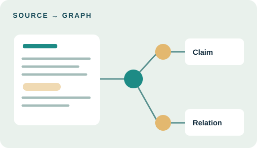
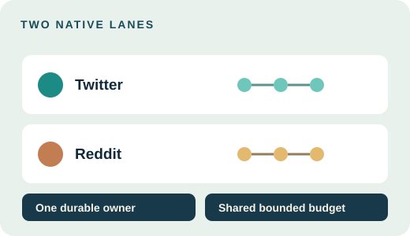
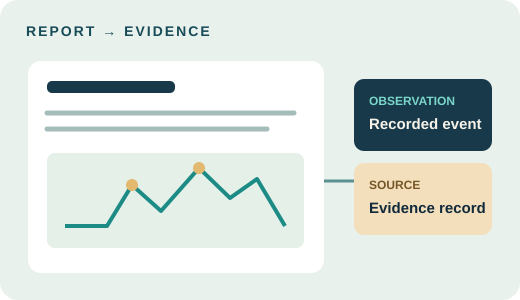

  
  <h1>NexaWeave</h1>
  
<strong>从来源资料出发，追踪证据、有界社交模拟与研究报告。</strong>

  
<code>个人研究</code> &nbsp; <code>AGPL-3.0</code> &nbsp; <code>持续开发</code>

  
<a href="README.md">English</a> · <a href="docs/product/overview.md">产品概览</a> · <a href="docs/product/development.md">源码开发</a> · <a href="docs/product/status.md">项目状态</a>

<em>架构示意图 · 完整连通流程仍在验证。</em>

NexaWeave 是个人研究工作台，用于探索有资料依据的观点在模拟社交环境中可能如何传播。它将来源资料、知识图谱、智能体行为与调查输出组织成可追溯的研究流程。

## 研究流程

<table>
  <tr>
    <td width="54%" valign="top">
      <h3>从证据开始</h3>
      
在提出问题时保留来源、抽取的主张和图谱关系。浏览图谱，并在报告引用发现前检查其来源。

    </td>
    <td width="46%"></td>
  </tr>
  <tr>
    <td width="54%" valign="top">
      <h3>观察两个社交环境</h3>
      
准备并检查 Twitter 与 Reddit 的有界原生模拟。持久所有权、共享预算和恢复机制让运行过程可以检查。

    </td>
    <td width="46%"></td>
  </tr>
  <tr>
    <td width="54%" valign="top">
      <h3>研究结果</h3>
      
通过报告、图谱研究和受保护的多语言工作台，将观察结果追溯至证据。访谈、问卷和后续问答仍在能力计划中。

    </td>
    <td width="46%"></td>
  </tr>
</table>

上述插图是原创矢量示意，不是产品截图，也不证明端到端流程已完成。

## 技术架构

NexaWeave 保留 Vue、Flask 和 OASIS/CAMEL。锁定的知识栈采用 Graphiti 与自托管 Neo4j Community；PostgreSQL 保存应用权威状态，Temporal 编排持久工作。生成模型可配置为官方 DeepSeek <code>deepseek-flash</code>，嵌入服务单独配置。全本地且无外部网络访问的模式尚未通过验证。

工作台仍在持续开发。已验证能力与剩余工作见[项目状态](docs/product/status.md)；命名迁移与已保存数据的兼容约定见[兼容性说明](docs/product/compatibility.md)。

## 从源码开发

目前支持的入口是源码开发：Python 3.12、Node 24.14.1 或更新版本、精简锁定测试依赖、本地知识包以及受保护的单元测试启动器。前端执行 <code>npm ci --ignore-scripts</code> 和 <code>npm run build</code>。[开发说明](docs/product/development.md)列出准确步骤及限制，不构成完整服务启动指南。付费模型调用必须有真实本地凭证和明确的总费用上限。

<a href="docs/product/overview.md">产品概览</a> · <a href="docs/product/development.md">源码开发</a> · <a href="docs/product/status.md">证据与状态</a> · <a href="ROADMAP.md">路线图</a> · <a href="CONTRIBUTING.md">参与贡献</a> · <a href="SECURITY.md">安全报告</a>

## 许可与声明

源码保留 [GNU AGPL v3 许可证](LICENSE)，所需署名见[第三方声明](THIRD_PARTY_NOTICES.md)。重新分发前请阅读两者。本项目不声称获得上游认可，也不主张替代许可证。
