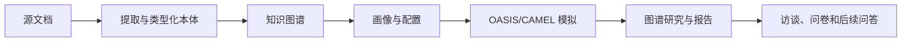

# NexaWeave

**源自 MiroFish、基于证据的智能体模拟与研究工作台。**

  

[English](README.md) · [开发说明](docs/development.md) · [路线图](ROADMAP.md)

NexaWeave 保留 MiroFish 的 Vue、Flask、OASIS/CAMEL 和调查报告流程作为源码基础。锁定架构采用 Graphiti + 自托管 Neo4j Community、PostgreSQL 应用权威存储及 Temporal 持久编排。付费模型执行必须具备本地凭证及明确的总费用上限。

> **源码公开，持续开发，尚无合格发布版本。** 最新验收基线为 `be004ce23bf5425ab28d9540428bea2759a6c4dc` / [PR86](https://github.com/desanv01/nexaweave-research-lab/pull/86)，交付有界图谱群体、来源依据和原生保存。PR81–86 的必需门槛已经审核。八个大工作流仍为部分实现；完整端到端流程、全部 44 项能力及发布验证尚未完成。U07c 图谱绑定的持久准备已编写，正由主会话进行本地和浏览器验证，尚未合并或验收。源码公开不代表应用已部署。

---

## Screenshots / 截图

此处尚未发布 NexaWeave 截图。计划使用合成数据截取引导流程、双平台监控、图谱与证据、报告与实验界面。[上游归档 README](docs/upstream/README-ZH.md.reference) 中的图片属于上游 MiroFish，不代表本项目的验收状态。

## Why this exists / 项目缘由

MiroFish 已连接资料、知识图谱、智能体群体、两种社交环境及调查报告。本衍生项目旨在保留这些能力，并提高证据、恢复、所有权、成本和部署的可检查性。24 项继承要求与 20 项升级见[能力清单](docs/plan/CAPABILITY-REGISTER.md)。

## What it does / 功能

继承源码包含文档摄取、类型化本体与图谱服务、模拟设置与运行、图谱浏览、报告、访谈、问卷及后续问答。这些是**从源码观察到的能力**，不是整个应用的验收结论。已验收的有界交付包含图谱群体、来源依据及原生导出保存。持久准备及完整模拟与报告流程仍在验证；见[当前状态](#current-status--当前状态)。

## How it works / 工作流程



Graphiti 和 Neo4j Community 是锁定知识栈，Zep 不是目标前置条件。此图描述继承流程及连通目标，不表示 NexaWeave 端到端流程已经通过验证。

### 从 U00 继承的开发检查

目前可执行的是离线源码检查流程，并非应用启动流程：

1. 安装精简单元测试依赖，检查导入源码清单。
2. 运行 `python tools/run_unit_tests.py`；它使用虚拟提供者密钥运行两个继承的 pytest 目录，禁用 `.env` 加载，阻止非本机回环连接，同时允许本地 HTTP 夹具。
3. 单独构建继承的 Vue 前端。这些检查不能验证完整后端或浏览器流程。

完整连通流程及发布门槛通过后，才会记录受支持的发布启动顺序。

## Requirements / 环境要求

| 用途 | 当前要求或状态 |
| --- | --- |
| 源码与单元工作 | 初始 CI 选择 Python 3.12 和 Node 24.14.1；后端元数据允许 Python 3.11–3.12。 |
| 前端夹具构建 | 使用 `frontend/package-lock.json` 和 npm；无需模型密钥或数据库。 |
| 完整继承后端 | 归档依赖仍含 OASIS/CAMEL、模型 API 与旧 Zep 集成；归档不是受支持的 NexaWeave 部署。 |
| 目标混合模式 | Graphiti/自托管 Neo4j Community、PostgreSQL、Temporal，以及分别配置的生成和嵌入提供者；完整部署验证尚未完成。 |
| 全本地模式 | U12 计划验证；目前没有断开云网络的保证。 |

继承的 `npm run dev`、`setup:all` 和 Docker 文件不应当作安全、受支持的启动路径。

## Quick start / 开始使用

### 检查源码

[归档清单](docs/upstream/archive-manifest.json) 记录 ZIP 及全部 128 个导入文件的哈希。使用 Python 3.12 运行 `python tools/check_baseline_manifest.py` 可以比较文件字节；此命令不验证应用行为。

### 离线开发构建

在仓库根目录进入 `frontend/`，执行 `npm ci --ignore-scripts` 和 `npm run build`。继承的夹具/单元测试需先在一次性 Python 3.12 环境中安装 `tools/ci-unit-requirements.txt`，以 `python -m pip install --no-deps services/knowledge` 安装本地权威存储包，然后运行 `python tools/run_unit_tests.py`。完整命令和范围见[开发说明](docs/development.md)。安装依赖需要访问软件包源；启动器将测试进程的连接限制为本机回环夹具。

### 启动、冒烟测试和打包

尚未声明合格的 NexaWeave 发布包或公开应用部署。安全启动、完整实时流程、持久卷、备份恢复和打包仍有未完成门槛。[发布页面](https://github.com/desanv01/nexaweave-research-lab/releases) 链接不表示已有合格制品。

## Command-line reference / 命令参考

| 命令 | 作用 |
| --- | --- |
| `python tools/check_baseline_manifest.py` | 检查 128 个导入路径和哈希；不一致时返回非零。 |
| `python tools/run_unit_tests.py` | 安装精简依赖后，以虚拟密钥和仅限本机回环的套接字防护运行继承的夹具/单元测试。 |
| 在 `frontend/` 执行 `npm run build` | 构建继承的 Vue 前端。 |

这些是开发检查命令，而非受支持的服务启动顺序。此表不声明完整的诊断、导出或迁移 CLI。

## Where things live / 数据位置

| 数据 | 当前路径或规则 |
| --- | --- |
| 源码来源 | `docs/upstream/archive-manifest.json`、`docs/upstream/import-notes.md` |
| 配置示例 | `.env.example`；不要提交填写后的 `.env` |
| 继承运行文件 | 可能使用 `backend/uploads/`、`backend/logs/`、`backend/data/`；均排除在 Git 外 |
| Neo4j/PostgreSQL 数据、快照与导出 | 由操作者配置并用于有界夹具；受支持的发布路径及备份流程仍待验证 |

## Project structure / 仓库结构

```text
backend/              继承的 Flask 应用、OASIS/CAMEL 集成与测试
frontend/             继承的 Vue/Vite 应用
tests/                根目录夹具测试与离线启动器回归测试
scripts/              继承的本地星标历史工具
docs/plan/            已批准的计划与能力要求
docs/upstream/        保留原始字节的参考文件与归档清单
coordination/         任务、交接和主会话验收记录
tools/                清单检查器、精简 CI 依赖与单元测试启动器
```

## Troubleshooting / 故障排查

清单检查器会报告缺失或修改的导入文件；经审查的修改必须逐文件记录，见[导入说明](docs/upstream/import-notes.md)。前端安装失败时先检查 Node 24.14.1 及已提交的锁文件。精简依赖下的测试失败可能揭示导入或依赖缺口，不能据此断定完整引擎状态。Zep 认证和配额错误属于**旧继承**运行环境；连通流程、迁移及恢复的完整操作说明仍待验证。

## Current status / 当前状态

截至 2026-10-05，验收基线为 `be004ce23bf5425ab28d9540428bea2759a6c4dc` / [PR86](https://github.com/desanv01/nexaweave-research-lab/pull/86)。主会话已审核 PR81–86 必需的 PR、推送、合并后门槛及完整日志。PR86 交付有界图谱群体、来源依据和原生保存，不代表完整模拟验收。八个大工作流及 44 项能力的最终验收仍未完成。U07c 持久准备已编写并有本地验证证据，但组合浏览器验证、托管门槛、合并及验收仍待完成。原生启动、模型质量和完整发布验证仍未完成。

**历史里程碑：** U01b（[PR6](https://github.com/desanv01/nexaweave-research-lab/pull/6)）及 U02a 文件路径安全补丁（[PR7](https://github.com/desanv01/nexaweave-research-lab/pull/7)）合并时通过 222 项 Linux 测试、17 项真实 Neo4j/合成模型测试、3 项 Windows/SQLite 原生动作测试、源码清单与前端构建。保留这些较早证据，不将其视为完整模拟、安全或无 Zep 应用验收。

早期 U00 已通过 [PR2](https://github.com/desanv01/nexaweave-research-lab/pull/2) 合并：167 项继承/保护测试、源码清单和前端构建通过。U01a 已通过 [PR5](https://github.com/desanv01/nexaweave-research-lab/pull/5) 合并：真实 Neo4j Community 配合合成模型通过17项知识测试，合并后 CI 也通过。ZIP SHA-256 为 `d3bef0afea92b99626526ffcce0508414feb3f9e88c3edda1f283ce5f447bf53`，对应 Git 提交仍未知，不等同于观察到的上游 HEAD `39d849138ef254f6c737ab4c4705e5545dbe31d4`。主会话在[工作台账](coordination/ledger.md)记录精确版本及限制。

## Roadmap / 路线图

- [x] U00：源码来源、仓库说明和初始 CI 验收。
- [ ] U01–U03：刻画继承行为，验证无 Zep 密钥的 Graphiti/Neo4j 全流程。
- [ ] U04–U10：持久化、证据、恢复、模拟与实验升级。
- [ ] U11–U14：多语言、全本地模式、摄取和性能、发布验证。

详细门槛见 [ROADMAP.md](ROADMAP.md)；勾选状态仅随主会话验收证据更新。

## Security / 安全

源码仓库按人类 2026-10-05 的决定公开；公开应用部署尚未授权或验证。使用合成夹具，避免将密钥和上传文档写入 Git；付费调用必须具备本地凭证及明确的总费用上限。完整安全和发布验证仍未完成。私下报告漏洞的方法见 [SECURITY.md](SECURITY.md)，不要在议题中公开密钥或利用资料。

## Contributing / 参与贡献

小范围 PR、来源记录、夹具要求及主会话审核流程见 [CONTRIBUTING.md](CONTRIBUTING.md)。当前有限检查见[开发说明](docs/development.md)。修改源码须保留相关 MiroFish 声明并对应能力清单。

## License and attribution / 许可与致谢

本项目是 MiroFish 的衍生项目。导入源码保留其 [GNU AGPL v3 许可证](LICENSE)及署名；替换知识服务不会自动改变其许可。Graphiti（Apache-2.0）、Neo4j Community（GPLv3）、OASIS/CAMEL、PyMuPDF/MuPDF 等组件各有条款。U00 尚未导入 Graphiti 或 Neo4j 代码。详见 [THIRD_PARTY_NOTICES.md](THIRD_PARTY_NOTICES.md) 和[导入说明](docs/upstream/import-notes.md)。本项目不代表上游维护者认可。

---

*NexaWeave 的状态以验收证据为准，不以已导入源码为准。*
