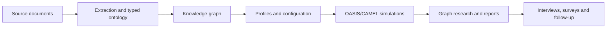

# NexaWeave

**An evidence-grounded agent simulation and research workbench, derived from MiroFish.**

  

[简体中文](README-ZH.md) · [Development notes](docs/development.md) · [Roadmap](ROADMAP.md)

NexaWeave retains MiroFish's Vue, Flask, OASIS/CAMEL and investigative workflow as the source base. The locked architecture uses Graphiti with self-hosted Neo4j Community, PostgreSQL application authority and Temporal durable orchestration. Paid model execution requires local credentials and a concrete total spending cap.

> **Public source; active development, no qualified release.** Latest accepted baseline: `be004ce23bf5425ab28d9540428bea2759a6c4dc` / [PR86](https://github.com/desanv01/nexaweave-research-lab/pull/86), delivering bounded graph population, grounding and native Save. PR81–86 have reviewed required gates. Eight broad workstreams remain partially implemented; the complete end-to-end workflow, all 44 capabilities and release qualification remain incomplete. U07c graph-bound durable preparation is authored and undergoing Main local/browser qualification; it is not merged or accepted. Public source visibility does not imply an application deployment.

---

## Screenshots

No NexaWeave screenshots are published here yet. Planned captures, with synthetic data, are: guided workflow; dual-platform monitor; graph and evidence; report and experiment views. The images in the [archived upstream README](docs/upstream/README.md.reference) depict upstream MiroFish, not this project's accepted state.

## Why this exists

MiroFish already joins source documents, a knowledge graph, agent populations, two social environments and investigative reports. This derived project aims to preserve those capabilities while making evidence, recovery, ownership, cost and deployment more inspectable. The 24 inherited requirements and 20 upgrades are tracked in the [capability register](docs/plan/CAPABILITY-REGISTER.md).

## What it does

The inherited source contains document ingestion, ontology and graph services, simulation setup and execution, graph exploration, reports, interviews, surveys and follow-up chat. These are **source-observed capabilities**, not whole-application acceptance claims. Accepted bounded work includes graph population, source grounding and native export Save. Durable preparation and the complete connected simulation/report journey remain under qualification. [Current status](#current-status) distinguishes delivered slices from remaining work.

## How it works



Graphiti and Neo4j Community are the locked knowledge stack; Zep is not a target prerequisite. The diagram describes the inherited workflow and connected target, not a verified end-to-end NexaWeave run.

### Development checks inherited from U00

The available sequence is an offline source check, not an application launch:

1. Install the lean Python unit dependencies and check the imported source manifest.
2. Run `python tools/run_unit_tests.py`; it starts both inherited pytest directories with dummy provider keys, disables `.env` loading and blocks non-loopback connections while allowing local HTTP fixtures.
3. Build the inherited Vue frontend separately. These checks do not qualify the complete backend or browser journey.

A supported release launch sequence will be documented after the complete connected workflow and release gates pass.

## Requirements

| Use | Current requirement or status |
| --- | --- |
| Source/unit work | Python 3.12 and Node 24.14.1 are the initial CI selections; backend metadata permits Python 3.11–3.12. |
| Frontend fixture build | `frontend/package-lock.json` and npm; no model key or database. |
| Full inherited backend | OASIS/CAMEL, model API and legacy Zep integration remain in the archived dependency set; that archive is not a supported NexaWeave deployment. |
| Target hybrid profile | Graphiti/self-hosted Neo4j Community, PostgreSQL, Temporal and separately configured generation/embedding providers; complete deployment qualification remains open. |
| Fully local profile | Planned for U12; no cloud-egress guarantee yet. |

Do not use the inherited `npm run dev`, `setup:all`, or Docker files as a safe supported startup path. They precede the provider replacement and security gates.

## Quick start

### Inspect and verify the source

The [archive manifest](docs/upstream/archive-manifest.json) records the source ZIP and all 128 imported file hashes. With Python 3.12, run `python tools/check_baseline_manifest.py` to compare them. This checks imported bytes, not application behavior.

### Build from source for offline development

From the repository root, `cd frontend`, `npm ci --ignore-scripts`, then `npm run build`. For inherited fixture/unit tests, return to the root, install `tools/ci-unit-requirements.txt` into a disposable Python 3.12 environment, install the local authority package with `python -m pip install --no-deps services/knowledge`, then run `python tools/run_unit_tests.py`. See [development notes](docs/development.md) for the exact commands and scope. Package installation needs access to package registries; the launcher restricts test-process connections to loopback fixtures.

### Run, smoke test and package

No qualified NexaWeave release package or public application deployment is claimed. Safe startup, the complete live workflow, persistent volumes, backup/restore and packaging have remaining acceptance gates. Watch [releases](https://github.com/desanv01/nexaweave-research-lab/releases) for qualified artifacts; no artifact is implied by this link.

## Command-line reference

| Command | Purpose |
| --- | --- |
| `python tools/check_baseline_manifest.py` | Verify all 128 imported paths and hashes; exit nonzero on mismatch. |
| `python tools/run_unit_tests.py` | Run inherited fixture/unit suites with dummy keys and a loopback-only socket guard after installing the lean profile. |
| `npm run build` in `frontend/` | Build the inherited Vue frontend. |

These are development checks, not a supported service launch sequence. This table makes no complete diagnosis, export or migration CLI claim.

## Where things live

| Data | Current location or policy |
| --- | --- |
| Source identity | `docs/upstream/archive-manifest.json` and `docs/upstream/import-notes.md` |
| Configuration sample | `.env.example`; never commit a filled `.env` |
| Imported runtime files | `backend/uploads/`, `backend/logs/`, `backend/data/` as applicable; excluded from Git |
| Neo4j/PostgreSQL data, snapshots, exports | Operator configuration and scoped fixtures; a supported release layout and backup procedure remain under qualification |

## Project structure

```text
backend/              Imported Flask app, OASIS/CAMEL integration, tests
frontend/             Imported Vue/Vite app
tests/                Root fixture tests and offline launcher regressions
scripts/              Imported local star-history utilities
docs/plan/            Approved plan and capability contract
docs/upstream/        Byte-preserved references and archive manifest
coordination/         Task packets, handoffs and main acceptance records
tools/                Manifest checker, lean CI profile, unit launcher
```

## Troubleshooting

The manifest checker reports missing or changed imported files; reviewed changes require explicit per-file exception records (see [import notes](docs/upstream/import-notes.md)). A failed frontend install should be checked against Node 24.14.1 and the committed frontend lockfile. Fixture tests may reveal dependency or import gaps in the lean profile; they do not prove a full engine install. Zep auth/quota errors belong to the **legacy inherited** runtime. Complete operational guidance for the connected workflow, migrations and restore awaits qualification.

## Current status

As of 2026-10-05, the accepted baseline is `be004ce23bf5425ab28d9540428bea2759a6c4dc` / [PR86](https://github.com/desanv01/nexaweave-research-lab/pull/86). PR81–86 required PR/push/post-merge gates and full logs were reviewed by Main. PR86 delivers bounded graph population, source grounding and native Save, rather than full simulation qualification. Eight broad workstreams and the 44-capability closeout remain open. U07c durable preparation has source authored and local qualification evidence; its combined browser qualification, hosted gates, merge and acceptance remain pending. Native launch, model quality and full release qualification remain open.

**Historical milestones:** U01b ([PR6](https://github.com/desanv01/nexaweave-research-lab/pull/6)) and the bounded U02a filesystem patch ([PR7](https://github.com/desanv01/nexaweave-research-lab/pull/7)) merged with 222 Linux tests, 17 real-Neo4j tests using synthetic models, three native Windows/SQLite action tests, source provenance and frontend build checks. These earlier results are retained evidence, not complete simulation, security or Zep-free application qualification.

Earlier U00 merged in [PR2](https://github.com/desanv01/nexaweave-research-lab/pull/2): 167 inherited/guard tests, source manifest and frontend build passed. U01a merged in [PR5](https://github.com/desanv01/nexaweave-research-lab/pull/5): 17 knowledge tests passed against real Neo4j Community with synthetic model clients; post-merge CI also passed. The ZIP SHA-256 is `d3bef0afea92b99626526ffcce0508414feb3f9e88c3edda1f283ce5f447bf53`; its Git commit remains unknown and is not equated with observed upstream HEAD `39d849138ef254f6c737ab4c4705e5545dbe31d4`. Main records exact revisions and limitations in the [ledger](coordination/ledger.md).

## Roadmap

- [x] U00: source provenance, repository presentation and initial CI accepted.
- [ ] U01–U03: characterize inherited behavior and qualify full Graphiti/Neo4j operation without a Zep key.
- [ ] U04–U10: persistence, evidence, recovery, simulation and experiment upgrades.
- [ ] U11–U14: languages, local mode, ingestion/performance and release qualification.

See [ROADMAP.md](ROADMAP.md) for phase gates. Boxes change only with main acceptance evidence.

## Security

The source repository is public by the human's 2026-10-05 decision; a public application deployment is not authorized or qualified. Use synthetic fixtures, keep keys and uploaded documents out of Git, and require local credentials plus a concrete total cap for paid calls. Complete security and release qualification remain open. Report vulnerabilities privately as described in [SECURITY.md](SECURITY.md); do not post secrets or exploit data in an issue.

## Contributing

Read [CONTRIBUTING.md](CONTRIBUTING.md) for small PRs, provenance, fixture expectations and the main review process. [Development notes](docs/development.md) cover the current limited checks. Source changes must preserve relevant MiroFish notices and follow the capability register.

## License and attribution

This is a derived MiroFish project. Imported MiroFish source retains its [GNU AGPL v3 license](LICENSE) and attribution; replacing its knowledge provider does not relicense it. Graphiti (Apache-2.0), Neo4j Community (GPLv3), OASIS/CAMEL, PyMuPDF/MuPDF and other components have their own terms. No Graphiti or Neo4j code is imported by U00. Read [THIRD_PARTY_NOTICES.md](THIRD_PARTY_NOTICES.md) and [import notes](docs/upstream/import-notes.md). This project is not endorsed by upstream maintainers.

---

*NexaWeave status is tied to accepted evidence, not the presence of imported code.*
