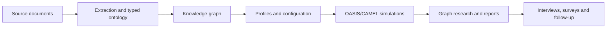

# MiroFish Research Lab

**An attributed MiroFish research workbench being upgraded for self-hosted knowledge and evidence-aware simulation.**

  

[简体中文](README-ZH.md) · [Development notes](docs/development.md) · [Roadmap](ROADMAP.md)

This repository retains MiroFish's Vue, Flask, OASIS/CAMEL and investigative workflow as the source base. The approved target uses Graphiti with self-hosted Neo4j Community for the knowledge graph. Paid model APIs may be used later with explicit configuration and limits.

> **Project status — U00 source import, unqualified.** The imported application still calls Zep Cloud. Graphiti/Neo4j is the implementation target, not an already working replacement. No complete Zep-free run, security hardening, release package or supported deployment is claimed. Do not expose the inherited baseline to a network or real research data. The CI profile below exercises fixture/unit code and a frontend build only.

---

## Screenshots

No Research Lab screenshots have been captured from an accepted build yet. Planned captures, with synthetic data, are: guided workflow; dual-platform monitor; graph and evidence; report and experiment views. The images in the [archived upstream README](docs/upstream/README.md.reference) depict upstream MiroFish, not this project's accepted state.

## Why this exists

MiroFish already joins source documents, a knowledge graph, agent populations, two social environments and investigative reports. This derived project aims to preserve those capabilities while making evidence, recovery, ownership, cost and deployment more inspectable. The 24 inherited requirements and 20 upgrades are tracked in the [capability register](docs/plan/CAPABILITY-REGISTER.md).

## What it does

The imported source contains document ingestion, ontology and graph services, simulation setup and execution, graph exploration, reports, interviews, surveys and follow-up chat. These are **source-observed capabilities**, not Research Lab acceptance claims. The operational Graphiti provider, provenance improvements, durable experiments and local-only mode are planned work. [Current status](#current-status) distinguishes them.

## How it works



Today the imported `C` path uses Zep Cloud. Graphiti and Neo4j Community are the locked replacement. The diagram describes the inherited workflow and intended provider cutover, not a verified end-to-end Research Lab run.

### Launch sequence at U00

The available sequence is an offline source check, not an application launch:

1. Install the lean Python unit dependencies and check the imported source manifest.
2. Run `python tools/run_unit_tests.py`; it starts both inherited pytest directories with dummy provider keys, disables `.env` loading and blocks non-loopback connections while allowing local HTTP fixtures.
3. Build the inherited Vue frontend separately. No Research Lab backend service or browser journey is qualified yet.

A supported runtime launch sequence will be documented after the Graphiti/Neo4j integration, security and live workflow gates pass.

## Requirements

| Use | Current requirement or status |
| --- | --- |
| Source/unit work | Python 3.12 and Node 24.14.1 are the initial CI selections; backend metadata permits Python 3.11–3.12. |
| Frontend fixture build | `frontend/package-lock.json` and npm; no model key or database. |
| Full inherited backend | OASIS/CAMEL, model API and Zep integration remain in the archived dependency set. This is not a supported Research Lab deployment. |
| Target hybrid profile | Self-hosted Graphiti/Neo4j Community plus configured model APIs; versions and resource needs await qualification. |
| Fully local profile | Planned for U12; no cloud-egress guarantee yet. |

Do not use the inherited `npm run dev`, `setup:all`, or Docker files as a safe supported startup path. They precede the provider replacement and security gates.

## Quick start

### Inspect and verify the source

The [archive manifest](docs/upstream/archive-manifest.json) records the source ZIP and all 128 imported file hashes. With Python 3.12, run `python tools/check_baseline_manifest.py` to compare them. This checks imported bytes, not application behavior.

### Build from source for offline development

From the repository root, `cd frontend`, `npm ci --ignore-scripts`, then `npm run build`. For inherited fixture/unit tests, return to the root, install `tools/ci-unit-requirements.txt` into a disposable Python 3.12 environment, then run `python tools/run_unit_tests.py`. See [development notes](docs/development.md) for the exact commands and scope. Package installation needs access to package registries; the launcher restricts test-process connections to loopback fixtures.

### Run, smoke test and package

There is no supported Research Lab run or release package at U00. Graphiti/Neo4j integration, safe local startup, live smoke tests, persistent volumes, backup/restore and release packaging have separate acceptance gates. Watch [releases](https://github.com/desanv01/mirofish-research-lab/releases) for qualified artifacts; no artifact is implied by this link.

## Command-line reference

| Command | Purpose |
| --- | --- |
| `python tools/check_baseline_manifest.py` | Verify all 128 imported paths and hashes; exit nonzero on mismatch. |
| `python tools/run_unit_tests.py` | Run inherited fixture/unit suites with dummy keys and a loopback-only socket guard after installing the lean profile. |
| `npm run build` in `frontend/` | Build the inherited Vue frontend. |

These are development checks, not service launch or export commands. No Research Lab CLI for diagnosis, export or migration exists yet.

## Where things live

| Data | Current location or policy |
| --- | --- |
| Source identity | `docs/upstream/archive-manifest.json` and `docs/upstream/import-notes.md` |
| Configuration sample | `.env.example`; never commit a filled `.env` |
| Imported runtime files | `backend/uploads/`, `backend/logs/`, `backend/data/` as applicable; excluded from Git |
| Future Neo4j/PostgreSQL data, snapshots, exports | Layout and backup procedure pending implementation and qualification |

## Project structure

```text
backend/              Imported Flask app, OASIS/CAMEL integration, tests
frontend/             Imported Vue/Vite app
tests/                Root fixture tests and offline launcher regressions
scripts/              Imported local star-history utilities
docs/plan/            Approved plan and capability contract
docs/upstream/        Byte-preserved references and archive manifest
coordination/         Task packets, handoffs and main acceptance records
tools/                Manifest checker, lean CI profile, unit launcher
```

## Troubleshooting

The manifest checker reports missing or changed imported files; reviewed changes require explicit per-file exception records (see [import notes](docs/upstream/import-notes.md)). A failed frontend install should be checked against Node 24.14.1 and the committed frontend lockfile. Fixture tests may reveal dependency or import gaps in the lean profile; they do not prove a full engine install. Zep auth/quota and live graph errors belong to the **inherited** runtime. Provider replacement, parse/graph lag handling, migrations and restore will receive operational guidance when qualified.

## Current status

U00 is implementing repository delivery against import base `c63c78e1229495894beeec68931bd355084b0da8`. The ZIP SHA-256 is `d3bef0afea92b99626526ffcce0508414feb3f9e88c3edda1f283ce5f447bf53`; its Git commit is unknown. The observed upstream head `39d849138ef254f6c737ab4c4705e5545dbe31d4` is a separate reference and has **not** been equated to the ZIP. No U00 checks or capability gates are declared accepted in this README. Main records exact revision and verification evidence in the [ledger](coordination/ledger.md).

## Roadmap

- [ ] U00: source provenance, repository presentation and initial CI accepted.
- [ ] U01–U03: characterize inherited behavior and qualify full Graphiti/Neo4j operation without a Zep key.
- [ ] U04–U10: persistence, evidence, recovery, simulation and experiment upgrades.
- [ ] U11–U14: languages, local mode, ingestion/performance and release qualification.

See [ROADMAP.md](ROADMAP.md) for phase gates. Boxes change only with main acceptance evidence.

## Security

This imported baseline is not suitable for public exposure. Use synthetic fixtures, keep keys and uploaded documents out of Git, and avoid paid or live jobs without approved limits. Security remediation and scoped access are planned gates. Report vulnerabilities privately as described in [SECURITY.md](SECURITY.md); do not post secrets or exploit data in an issue.

## Contributing

Read [CONTRIBUTING.md](CONTRIBUTING.md) for small PRs, provenance, fixture expectations and the main review process. [Development notes](docs/development.md) cover the current limited checks. Source changes must preserve relevant MiroFish notices and follow the capability register.

## License and attribution

This is a derived MiroFish project. Imported MiroFish source retains its [GNU AGPL v3 license](LICENSE) and attribution; replacing its knowledge provider does not relicense it. Graphiti (Apache-2.0), Neo4j Community (GPLv3), OASIS/CAMEL, PyMuPDF/MuPDF and other components have their own terms. No Graphiti or Neo4j code is imported by U00. Read [THIRD_PARTY_NOTICES.md](THIRD_PARTY_NOTICES.md) and [import notes](docs/upstream/import-notes.md). This project is not endorsed by upstream maintainers.

---

*Research Lab status is tied to accepted evidence, not the presence of imported code.*
