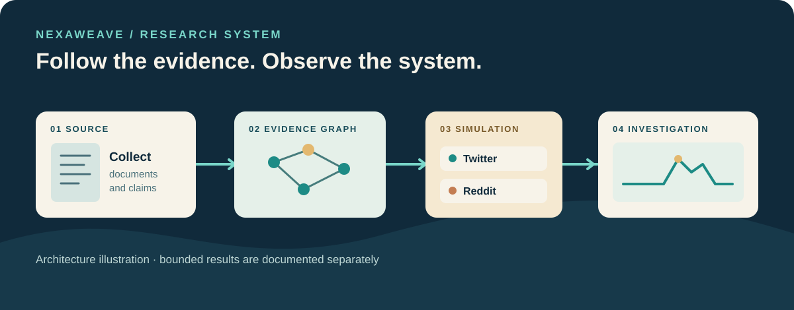

# A research workbench for evidence and simulation

NexaWeave helps a researcher move from source material to a question, a graph of claims and relationships, a bounded social simulation, and an inspectable report. It is public source in active development, with no qualified release or public app deployment.

This is an original architecture illustration, not a screenshot or evidence of a complete end-to-end run.

## The research path

1. **Collect and ground.** Keep source material available while extracting entities, claims and relationships. Graph exploration helps a reader trace a finding back to its evidence.
2. **Prepare a bounded simulation.** Agent profiles and configurations feed OASIS/CAMEL native Twitter and Reddit environments. Shared ownership, budgets, cancellation and recovery make the run inspectable.
3. **Examine and report.** Investigative reports and graph research connect observations to the source. Interviews, surveys and follow-up are part of the broader capability plan.

The accepted baseline includes a bounded two-platform report journey with scripted offline models. The full workflow and all 44 capability gates remain open. [Status and evidence](status.md) separates accepted, locally checked and pending work.

## Architecture choices

The UI uses Vue, the backend uses Flask, and native simulation behavior uses OASIS/CAMEL. Graphiti with self-hosted Neo4j Community is the locked knowledge stack. PostgreSQL holds application authority, and Temporal coordinates durable work. Generation can use the official DeepSeek deepseek-flash target; embeddings are separately configured. A no-egress local mode is not qualified.

## Continue

- [Develop from source](development.md)
- [Current status](status.md)
- [Capability register](../plan/CAPABILITY-REGISTER.md)
- [Roadmap](../../ROADMAP.md)
